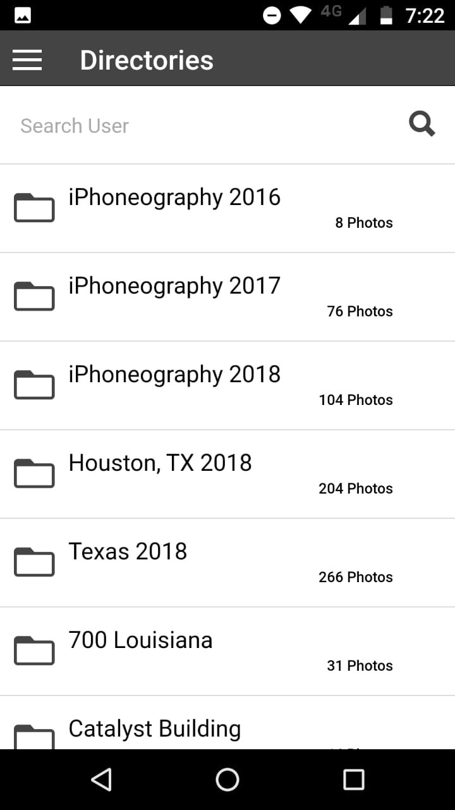
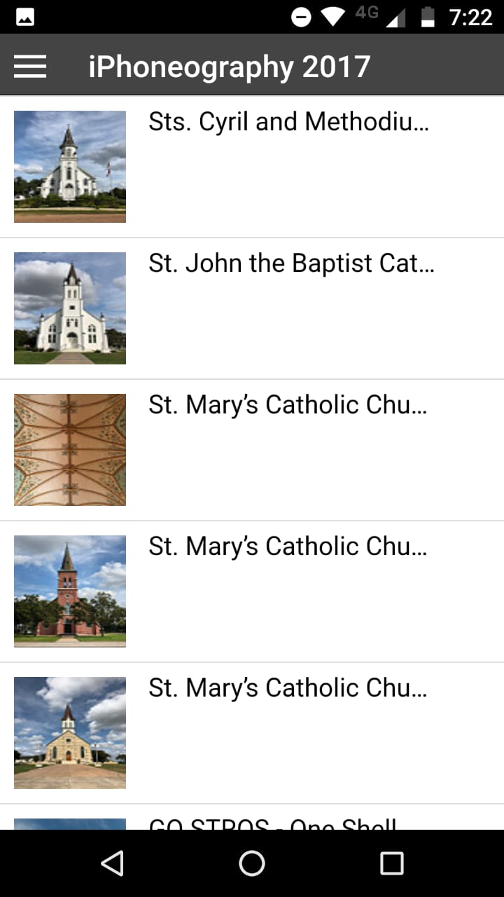

Flickr Api - Ionic
=====================
Hybrid application that offers the possibility to search Flickr users, viewing each of their directories with their photos. It also allows to see comments in them and share them by email. It provides a search system based on preferences and has international support.


## Steps

```bash
$ git clone https://gitlab.com/facuRossi/TPI-DSM-FLICKR-API.git
$ cordova prepare
$ mv gulpfile.js gulpfile.js.unused
```

## Demo







## Developers

Rossi Facundo